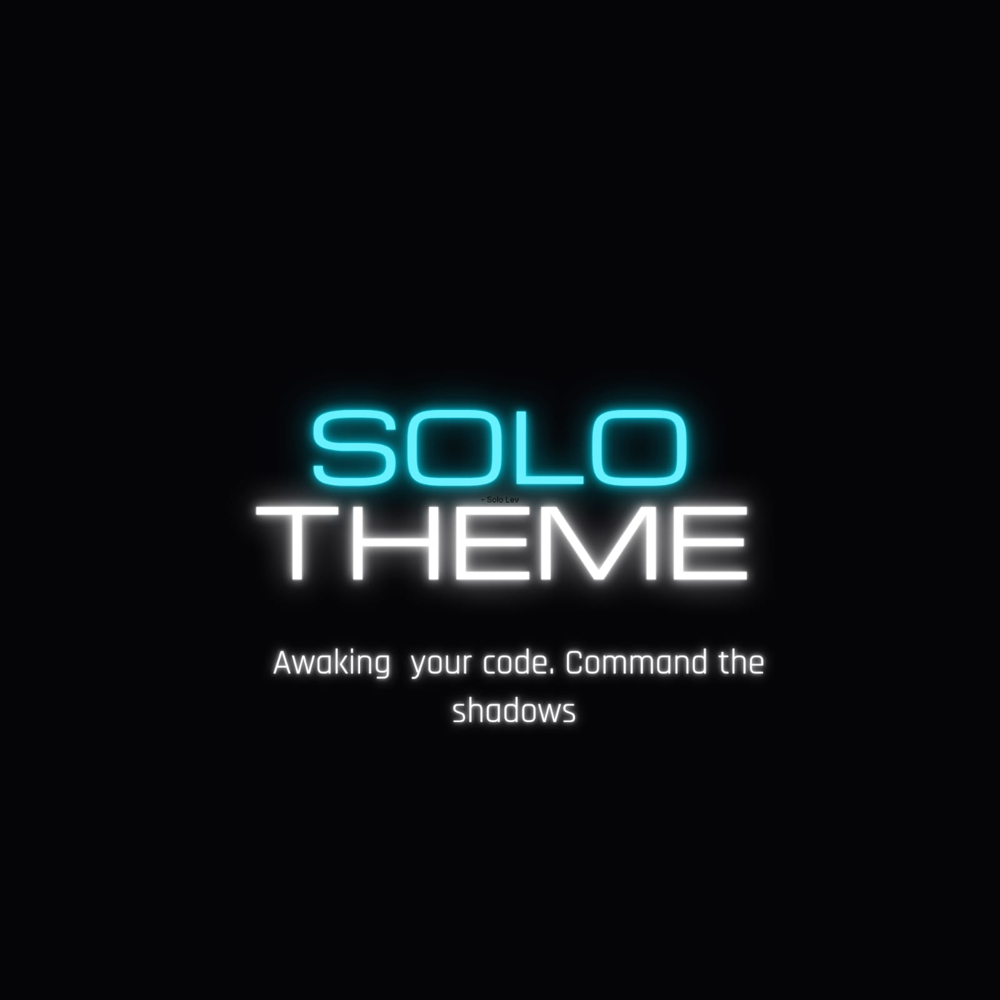

<h1>SoloTheme: Shadow Monarch Edition</h1>

<b>Awaken your code. Rule the shadows.</b>

<a href="https://www.google.com/search?q=%23">🌐 Official Website</a> |
<a href="https://www.google.com/search?q=%23">🛒 VS Code Marketplace</a> |
<a href="https://www.google.com/search?q=%23">🐛 Report Bugs</a>

🌑 The Concept

SoloTheme is a premium, high-contrast dark theme for Visual Studio Code, meticulously crafted by CodeMonarch for developers who demand perfection. Inspired by the "Shadow Monarch" aesthetic, it balances deep obsidian tones with vibrant mana-infused accents to create a legendary coding environment.

✨ S-Rank Features

The Monarch's Palette: Deep obsidian backgrounds (#050608) paired with neon cyan (#00E5FF) and royal purple (#9D4EDD) syntax highlighting.

Enhanced Focus: High-visibility UI elements designed to reduce eye strain during long "dungeon raids" (coding sessions).

Precision Syntax: Lethal precision in code highlighting, making it easier to spot bugs and structure.

Tektur Integration: Optimized to look exceptional with futuristic variable-width fonts.

📸 Preview

<i>The Shadow Monarch Edition.</i>

🛠 Installation

Via VS Code Marketplace

Open VS Code.

Go to Extensions (Ctrl+Shift+X).

Search for SoloTheme or CodeMonarch.

Click Install and select SoloTheme - Shadow Monarch Edition as your color theme.

Via VSIX (Manual)

Download the latest .vsix from our Releases.

Inside VS Code, click the ... menu in the Extensions view.

Select Install from VSIX... and upload the file.

📜 License

This project is licensed under the MIT License.

Developed with ❤️ by <b>CodeMonarch</b>

<i>"The System has granted you a new power. Will you accept it?"</i>

<kbd> [ Yes ] </kbd> / <kbd> [ No ] </kbd>

